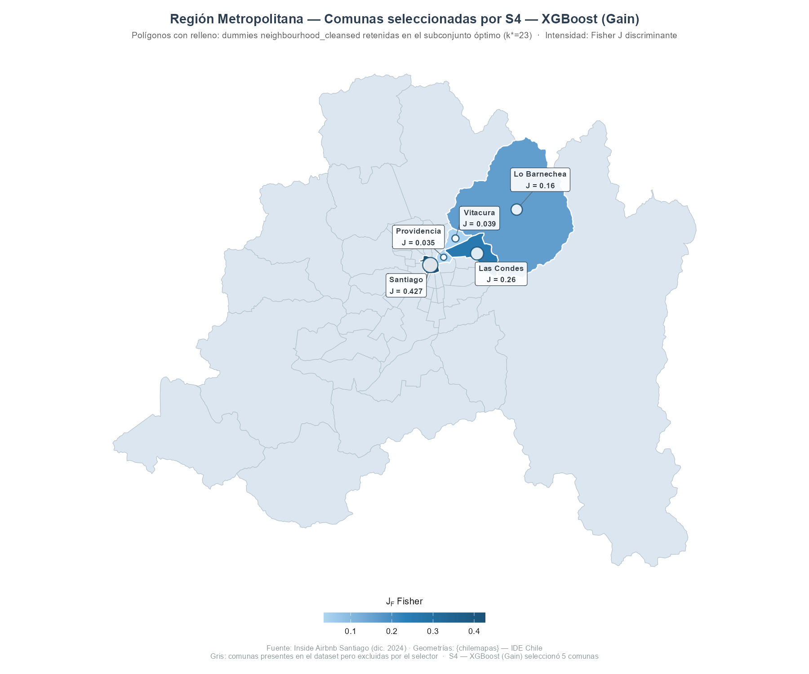

# SVR Regression · Airbnb Santiago Pricing

**Support Vector Regression aplicado a predicción de precios de alojamiento — Santiago, Chile (Inside Airbnb, dic. 2024)**

---

## Descripción

Pipeline de machine learning end-to-end que predice el precio de publicación de listings Airbnb en Santiago usando **SVR con kernel RBF**, cubriendo preprocesamiento, selección comparativa de características entre seis métodos, tuning de hiperparámetros y validación sobre datos no vistos.

**Rendimiento en Test:** RMSE = 0.3544 (log1p) · R² = 0.706 · MAE ≈ CLP 16.161/noche

---

## Pipeline

```
Raw Data → Filtro Precio → EDA → Encoding → Train/Test Split
→ Clean Algorithm → Normalización MinMax → Selección Comparativa → SVR Tuning → Evaluación
```

| Fase | Pasos |
|---|---|
| Datos & EDA | Carga · Inventario · Categorización · Filtro precio · OHE |
| Preprocesamiento | Clean Algorithm (constantes + correladas) · MinMax solo en Train |
| Selección features | 6 selectores · k\* compartido · CV-5 exclusivo en Train |
| Modelamiento | SVR RBF · Grid Search · Validación cruzada |
| Evaluación | Métricas Train/Test · Residuos · Back-transform a CLP |
| Operación | Datos nuevos sintéticos · Segmentación · Framework de intervención |

---

## Selección de Características — Estrategia Comparativa

Seis selectores compiten bajo condiciones idénticas: mismo **k\* = 23** (consenso entre k naturales de Fisher J, Elastic Net y Random Forest), mismo evaluador SVR (C=5, γ=0.05, ε=0.1), CV-5 exclusivamente sobre Train. Test permanece sellado hasta la evaluación final.

| Selector | Tipo | Score Ψ |
|---|---|---|
| **S4 — XGBoost (Gain)** ✔ | Embedded · no lineal | **0.8496** |
| S5 — Random Forest | Embedded · permutación | 0.8446 |
| S6 — SFS-SVR | Wrapper · greedy | 0.8416 |
| S3 — Branch & Bound | Filter · multivariado | 0.8376 |
| S2 — Elastic Net | Embedded · L1+L2 | 0.8331 |
| S1 — Fisher J | Filter · univariado | 0.8301 |

**Criterio de selección del ganador:**
$$\Psi_s = \frac{1}{2}\left(1 - \frac{\text{RMSE}_s^{CV} - \min\text{RMSE}^{CV}}{\max\text{RMSE}^{CV} - \min\text{RMSE}^{CV}}\right) + \frac{1}{2} \cdot R^{2,CV}_s$$

---

## Resultados

| Métrica | Train | Test |
|---|---|---|
| RMSE (log1p) | 0.3251 | 0.3544 |
| MAE (log1p) | — | 0.2413 |
| R² | 0.7492 | 0.7058 |
| RMSE (CLP) | — | ~34.741 |
| MAE (CLP) | — | ~16.161 |

Brecha Train–Test: ΔR² = 0.044 · Sin sobreajuste relevante.

---

## Análisis Geográfico

El modelo identificó **5 comunas** con poder de discriminación de precio estadísticamente significativo. El mapa muestra sus scores Fisher J sobre la cartografía oficial de la Región Metropolitana.



> Comunas retenidas por XGBoost (Gain): **Las Condes · Lo Barnechea · Providencia · Vitacura · Santiago**. Las exclusiones son basadas en datos, no editoriales: comunas con distribuciones de precio homogéneas respecto a la línea base regional no aportan valor predictivo bajo el evaluador SVR-CV5.

---

## Stack

| Capa | Herramientas |
|---|---|
| Lenguaje | R 4.x |
| Modelamiento | `e1071` · `caret` |
| Selección features | `glmnet` · `randomForest` · `xgboost` · Fisher J / B&B / SFS custom |
| Visualización | `ggplot2` · `chilemapas` · `sf` · `igraph` |
| Reporte | Quarto (`.qmd`) → HTML autocontenido |

---

## Estructura del Repositorio

```
├── SVM_REGRESION.qmd          # Reporte reproducible completo (Quarto)
├── listings.csv.gz            # Datos brutos — Inside Airbnb Santiago (dic. 2024)
├── georef_comunas_RM.png      # Mapa georreferenciado — comunas seleccionadas
└── README.md
```

> **Para renderizar:** actualizar la ruta de `listings.csv.gz` en el chunk `load-raw` y ejecutar `quarto render SVM_REGRESION.qmd`.

---

## Fuente de Datos

[Inside Airbnb — Santiago de Chile](https://insideairbnb.com/get-the-data/) · Diciembre 2024

---

*Alejandro Figueroa Rojas · Data & Business Intelligence*  
[](https://www.linkedin.com/in/alejandrofigueroarojas)
